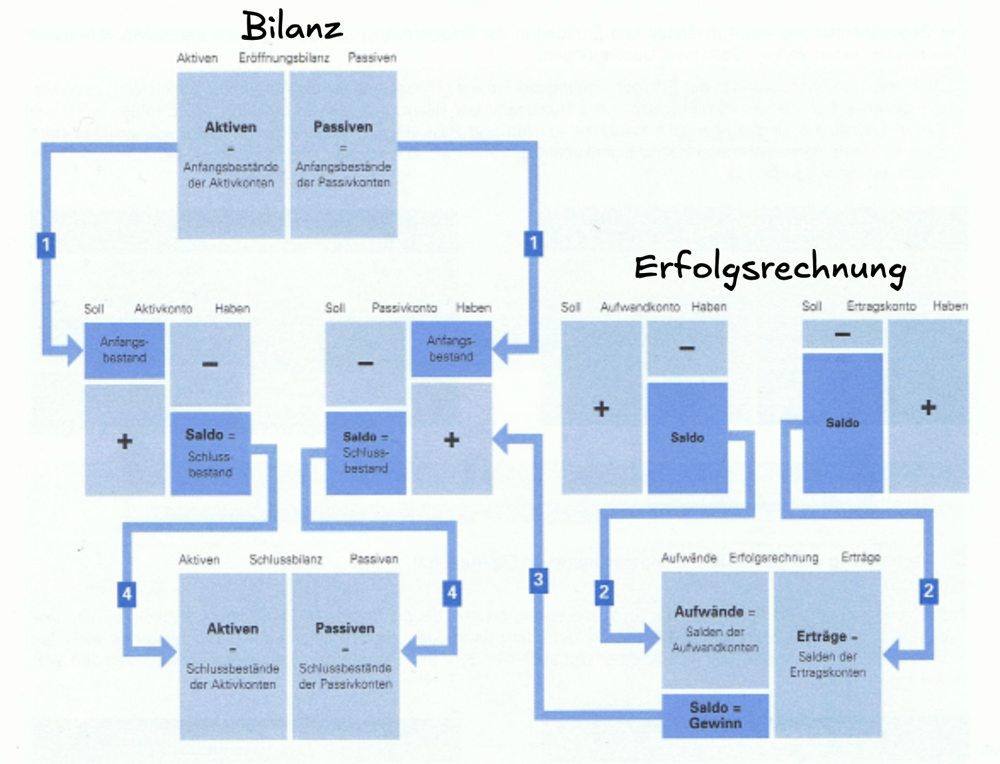

# Todo
## Things to track / calculate
### Income statement
- [x] Purchase / selling of machines
- [x] Production costs
	- [x] Energy costs 
	- [x] Material costs
	- [x] Logistics costs
- [ ] Administration costs
- [x] Normal loan calculations
- [ ] Bridge loan calculations 
- [ ] Totals

### Balance sheet
#### Assets
- [x] Interest
- [x] Machines
- [x] Real estate
	- [x] Warehouses
	- [x] Production facilities
- [x] Stock (product)
- [ ] Stocks
#### Liabilities
- [x] Loans
- [x] Equity